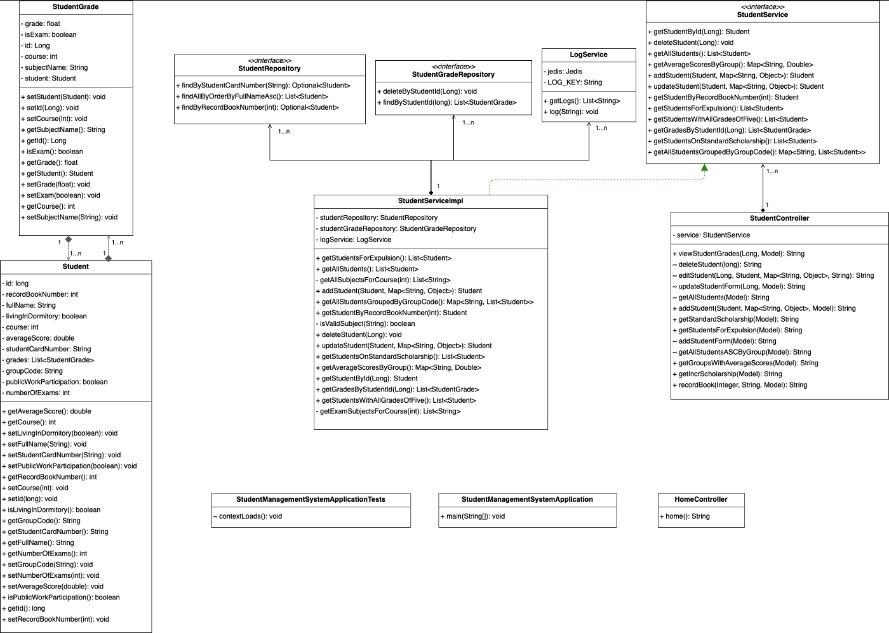

# Student Management System
Student Management System is a web-based application that can be used to manage an institution's data related to students and their courses

## Home page

## UML Class Diagram 

## Built With
<ul>
  <li>Java</li>
  <li>Spring Boot</li>
  <li>Spring MVC</li>
  <li>HTML</li>
  <li>CSS</li>
  <li>MySQL</li>
  <li>Redis</li>
  <li>Hibernate</li>
  <li>Maven</li>
</ul>